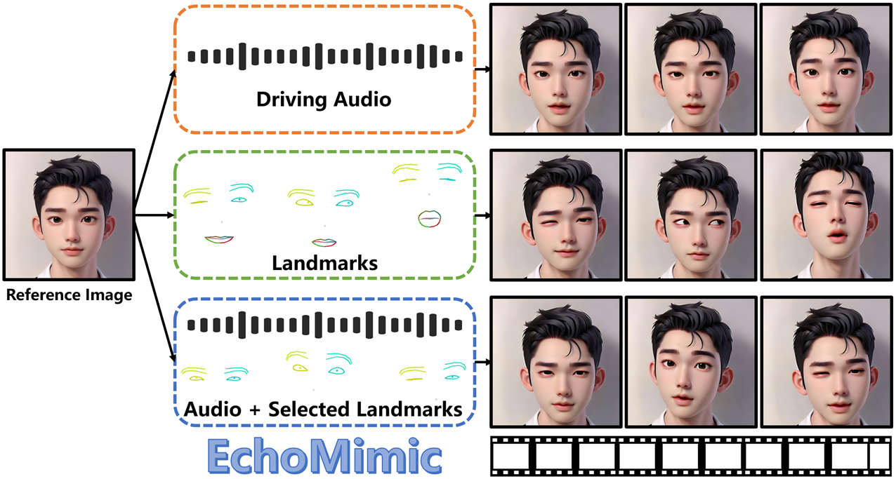
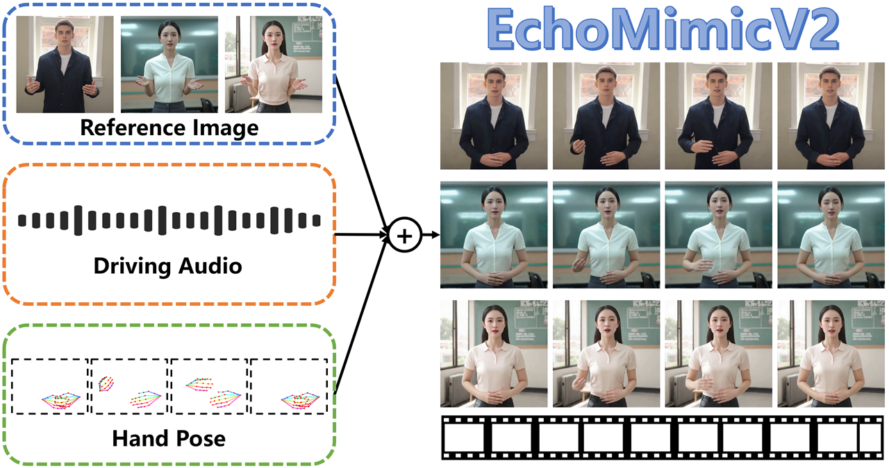

 Yuming obtained his B.E. and M.E. degrees from Dept. of Electronic Engineering,  <a href="http://english.hust.edu.cn/">Huazhong University of Science and Technology</a> in 2011 and 2013 respectively, under the supervision of <a href="http://ei.hust.edu.cn/professor/caohanqiang/">Prof. Hanqiang CAO</a>. He obtained his PhD degree from Dept. of Electronic Engineering, <a href="https://www.cityu.edu.hk/">City University of Hong Kong</a> in 2016, under the supervision of <a href="http://www.ee.cityu.edu.hk/~lmpo/">Prof. Lai-Man PO</a>. He is currently a  staff engineer at <a href="https://www.antgroup.com/en">Ant Group</a>.

# 📖 Educations
- *2013.09-2016.07*, Ph.D. Dept. of Electronic Engineering, City University of Hong Kong.
- *2011.09-2013.06*, M.E. Dept. of Electronic Engineering, Huazhong University of Science and Technology.
- *2007.09-2011.06*, B.E. Dept. of Electronic Engineering, Huazhong University of Science and Technology.

# 💻 Experience
- *2020.12-present*, Staff Engineer, Alipay Biometric Group, Ant Group.
- *2017.12-2020.12*, Researcher, Deep Learning Group, MiniEye.
- *2016.07-2017.11*, Researcher, Autonomous Driving Lab, Tencent.
- *2015.03-2015.08*, Visiting Scholar, Brain Matrix Lab , Tsinghua University.

# 📈 Open Source Projects

AAAI 2025

  
[EchoMimic: Lifelike Audio-Driven Portrait Animations through Editable Landmark Conditioning](https://arxiv.org/abs/2407.08136)

Zhiyuan Chen*, Jiajiong Cao*, Zhiquan Chen, **Yuming Li**, Chenguang Ma

[**project**](https://antgroup.github.io/ai/echomimic/)&emsp;[**code**](https://github.com/antgroup/echomimic)&emsp;

arxiv

  
[EchoMimicV2: Towards Striking, Simplified, and Semi-Body Human Animation](https://arxiv.org/abs/2411.10061)

Rang Meng, Xingyu Zhang, **Yuming Li**, Chenguang Ma

[**project**](https://antgroup.github.io/ai/echomimic_v2/)&emsp;[**code**](https://github.com/antgroup/echomimic_v2)&emsp;

# 📝 Publications
**Journal Papers**
1. L.M. Po, M. Liu, Y.F. Yuen, **Y. Li**, X. Xu, C. Zhou, P.H.W. Wong, K.W. Lau, H.T. Luk. &quot;<a class="dhtgD aw5Odc" href="http://www.google.com/url?q=http%3A%2F%2Fwww.ee.cityu.edu.hk%2F~lmpo%2Fpublications%2F2019_CNN_NRIQA_TCSVT.pdf&amp;sa=D&amp;sntz=1&amp;usg=AFQjCNFGPexh49nOsdYKy5tzJKhjOK3LZw" target="_blank">A Novel Patch Variance Biased Convolution Neural Network for No-Reference Image Quality Assessment</a>,&quot; IEEE Trans. on Circuits and Systems for Video Technology (2019).
2. M. Liu, L. M. Po, YAU Rehman, X. Xu, **Y. Li**, L. Feng, &quot;<a class="dhtgD aw5Odc" href="https://www.google.com/url?q=https%3A%2F%2Fwww.researchgate.net%2Fpublication%2F327536741_Video_copy_detection_by_conducting_fast_searching_of_inverted_files&amp;sa=D&amp;sntz=1&amp;usg=AFQjCNFiuMwRqSa61O3UZLoAR0c-bKVVhA" target="_blank">Video copy detection by conducting fast searching of inverted files</a>,&quot; Multimedia Tools and Applications (2018): 1-24.
3. L.M. Po, L. Feng, **Y. Li**, X. Xu, C.H. Cheung, K.W. Cheung, &quot;<a class="dhtgD aw5Odc" href="http://www.google.com/url?q=http%3A%2F%2Fwww.ee.cityu.edu.hk%2F~lmpo%2Fpublications%2F2017_MTA_ROI_VPPG.pdf&amp;sa=D&amp;sntz=1&amp;usg=AFQjCNEWqDIK-AfKU6iFX18wlKDMuqPNRA" target="_blank">Block-based adaptive ROI for remote photoplethysmography</a>,&quot; Multimedia Tools and Applications 77.6 (2018): 6503-6529.
4. L. Feng, L.M. Po, **Y. Li**, F. Yuan, <a class="dhtgD aw5Odc" href="http://www.google.com/url?q=http%3A%2F%2Fwww.ee.cityu.edu.hk%2F~lmpo%2Fpublications%2F2017_JEI_face_liveness.pdf&amp;sa=D&amp;sntz=1&amp;usg=AFQjCNH3Yo3XMB-xMdlqtOMgkGl1q0kKwQ" target="_blank">Face liveness detection using shearlet based feature descriptors</a>,&quot; Journal of Electronic Imaging, 25(4), August 2016. (<a class="dhtgD aw5Odc" href="https://www.youtube.com/watch?v=t4O2bbF61Tk" target="_blank">Youtube Demo</a>)
5. L. Feng, L.M. Po, **Y. Li**, X. Xu, F. Yuan, C.H. Cheung, K.W. Cheung, &quot;<a class="dhtgD aw5Odc" href="http://www.google.com/url?q=http%3A%2F%2Fwww.ee.cityu.edu.hk%2F~lmpo%2Fpublications%2F2016_Jouranl_VCIR_Face_Liveness.pdf&amp;sa=D&amp;sntz=1&amp;usg=AFQjCNFB3BHigbLvaMQkcMNAfWqEUINS4w" target="_blank">Integration of Image Quality and Motion Cues for Face Anti-Spoofing: a Neural Network Approach</a>,&quot; Journal of Visual Communication and Image Representation, Volume 38, pp. 451-460, July 2016. (<a class="dhtgD aw5Odc" href="https://www.youtube.com/watch?v=151USnKDKZY&amp;feature=youtu.be" target="_blank">Youtube Demo</a>)
6. **Y. Li**, L.M. Po, C.H. Cheung, X. Xu, L. Feng, F. Yuan, K.W. Cheung, &quot;<a class="dhtgD aw5Odc" href="http://www.google.com/url?q=http%3A%2F%2Fwww.ee.cityu.edu.hk%2F~lmpo%2Fpublications%2F2015_IEEE_TCSVT_VQA.pdf&amp;sa=D&amp;sntz=1&amp;usg=AFQjCNHCWEPC-193St1PGDxtIaLQVPyiBQ" target="_blank">No-Reference Video Quality Assessment with 3D Shearlet Transform and Convolutional Neural Networks</a>,&quot; IEEE Trans. on Circuits and Systems for Video Technology, Vol. 26, Issue 6, pp. 1044-1057, June 2015.
7. **Y. Li**, L.M. Po, X. Xu, L. Feng, F. Yuan, C.H. Cheung, K.W. Cheung, &quot;<a class="dhtgD aw5Odc" href="http://www.google.com/url?q=http%3A%2F%2Fwww.ee.cityu.edu.hk%2F~lmpo%2Fpublications%2F2015_Neurocomputing_IQA.pdf&amp;sa=D&amp;sntz=1&amp;usg=AFQjCNHlehu-WoSHbtI4NVDU7_sFHBOKdA" target="_blank">No-reference image quality assessment with shearlet transform and deep neural networks</a>,&quot; Neurocomputing, Volume 154, Pages 94–109, April 2015.
8. L. Feng, L.M. Po, X. Xu, **Y. Li**, R. Ma, &quot;<a class="dhtgD aw5Odc" href="http://www.google.com/url?q=http%3A%2F%2Fwww.ee.cityu.edu.hk%2F~lmpo%2Fpublications%2F2015_IEEE_TCSVT_rPPG.pdf&amp;sa=D&amp;sntz=1&amp;usg=AFQjCNEwdAzcXqOBMrksXVQcRhbXS6aF-g" target="_blank">Motion Resistant Remote Imaging Photoplethysmography Based on Optical Properties of Skin</a>,&quot; IEEE Trans. on Circuits and Systems for Video Technology, Vol. 25, Issue 5, pp. 879-891, October 2014.
9. **Y. Li**, L.M. Po, X. Xu, L. Feng, &quot;<a class="dhtgD aw5Odc" href="http://www.google.com/url?q=http%3A%2F%2Fwww.sciencedirect.com%2Fscience%2Farticle%2Fpii%2FS0923596514000873&amp;sa=D&amp;sntz=1&amp;usg=AFQjCNGqxGM-c35EHTXJsB7SfQL_PAFH1A" target="_blank">No-reference image quality assessment using statistical characterization in the shearlet domain</a>,&quot; Signal Processing: Image Communication, Vol. 29, Issue 7, pp. 748-75, August 2014.
    
**Conference Papers**
1. M. Liu, L. M. Po, YAU Rehman, X. Xu, **Y. Li**, L. Feng, <a class="dhtgD aw5Odc" href="http://www.google.com/url?q=http%3A%2F%2Fwww.ee.cityu.edu.hk%2F~lmpo%2Fpublications%2F2017_SPA_VCD.pdf&amp;sa=D&amp;sntz=1&amp;usg=AFQjCNEPJXiVzwMP76S9kaHjOC665jOq5g" target="_blank">&quot;A novel inverted index file based searching strategy for video copy detection</a>,&quot; Signal Processing: Algorithms, Architectures, Arrangements, and Applications (SPA), 2017.
2. **Y. Li**, J. Wang, T. Xing, T. Liu, C. Li, K. Su, &quot;<a class="dhtgD aw5Odc" href="http://www.google.com/url?q=http%3A%2F%2Fautopilot.qq.com%2FICIP2017%2F&amp;sa=D&amp;sntz=1&amp;usg=AFQjCNFxg3aL78MlXolNKo01QqaK5fFBXg" target="_blank">TAD16K: an enhanced benchmark for autonomous driving</a>,&quot; IEEE International Conference on Image Processing (ICIP), September 2017.
3. **Y. Li**, L. M. Po, L. Feng, F. Yuan, &quot;<a class="dhtgD aw5Odc" href="http://www.google.com/url?q=http%3A%2F%2Fwww.ee.cityu.edu.hk%2F~lmpo%2Fpublications%2F2016_DSP_NFIQA_CNN.pdf&amp;sa=D&amp;sntz=1&amp;usg=AFQjCNE3qTkd1qDzuiA_ThZQBkwb927PyA" target="_blank"> No-reference Image Quality Assessment with Deep Convolutional Neural Networks</a>,&quot; Proceeding of 2016 IEEE International Conference on Digital Signal Processing (DSP), Beijing, China, 16-18 October, 2016.
4. **Y. Li**, L. M. Po, X. Xu, L. Feng, F. Yuan, &quot;<a class="dhtgD aw5Odc" href="http://www.google.com/url?q=http%3A%2F%2Fwww.ee.cityu.edu.hk%2F~lmpo%2Fpublications%2F2016_ICASSP_Face_Liveness.pdf&amp;sa=D&amp;sntz=1&amp;usg=AFQjCNERZA8QQgMnM5xkFQDFjapMiSziIw" target="_blank"> Face Liveness Detection and Recognition using Shearlet based Feature Descriptiors</a>,&quot; Proceeding of 2016 International Conference on Acoustics, Speech, and Signal Processing, ICASSP2016, Shanghai, China, pp. 874 - 877, March 2016.
5. F. Yuan, L. M. Po, L. Feng, **Y. Li**, X. Xu, &quot;A Robust MEL-Bands Audio Fingerprint based on Spectral Local Maximum Energy for Content based Copy Detection,&quot; International Congress on Engineering and Information (ICEAI 2016), Osaka, Japan, May 2016.
6. **Y. Li**, L. M. Po, X. Xu, L. Feng, F. Yuan, C. H. Cheung, K. W. Cheung, &quot;<a class="dhtgD aw5Odc" href="http://www.google.com/url?q=http%3A%2F%2Fwww.ee.cityu.edu.hk%2F~lmpo%2Fpublications%2F2015_ISCAS_IQA.pdf&amp;sa=D&amp;sntz=1&amp;usg=AFQjCNGa4WydBhdOk4_7vONIwlUFq5C0_w" target="_blank"> No-Reference Image Quality Assessment Using Shearlet Transform and Stacked Autoencoders</a>,&quot; Proceeding of 2015 IEEE International Symposium on Circuits and Systems, ISCAS2015, Lisbon, Portugal, May 2015.
7. L. M. Po, X. Xu, L. Feng, **Y. Li**, K. W. Cheung, C. H. Cheung, &quot;<a class="dhtgD aw5Odc" href="http://www.google.com/url?q=http%3A%2F%2Fwww.ee.cityu.edu.hk%2F~lmpo%2Fpublications%2F2015_ISCAS_PPG.pdf&amp;sa=D&amp;sntz=1&amp;usg=AFQjCNFqGc0WGIIORFzZoe2Ed8vKy07ISA" target="_blank">Frame Adaptive ROI for Photoplethysmography Signal Extraction from Fingertip Video Captured by Smartphone</a>,&quot; Proceeding of 2015 IEEE International Symposium on Circuits and Systems, ISCAS2015, Lisbon, Portugal, May 2015.
8. L. Feng, L. M. Po, X. Xu, **Y. Li**, C. H. Cheung, K. W. Cheung, Y. Fang, &quot;<a class="dhtgD aw5Odc" href="http://www.google.com/url?q=http%3A%2F%2Fwww.ee.cityu.edu.hk%2F~lmpo%2Fpublications%2F2015_ICASSP_rPPG.pdf&amp;sa=D&amp;sntz=1&amp;usg=AFQjCNEHKii1tV1N_uNTdvoekovH_IVRhg" target="_blank">Dynamic ROI Based on K-Means for Remote Photoplethysmography</a>,&quot; Proceeding of 2015 International Conference on Acoustics, Speech, and Signal Processing, ICASSP2015, April 2015.
9. L. Feng, L. M. Po, X. Xu, **Y. Li**, &quot;<a class="dhtgD aw5Odc" href="http://www.google.com/url?q=http%3A%2F%2Fwww.ee.cityu.edu.hk%2F~lmpo%2Fpublications%2F2014_ICDSP_rPPG.pdf&amp;sa=D&amp;sntz=1&amp;usg=AFQjCNHBILaJ2YMeyfEw7l6USyFrWUxiCw" target="_blank"> Motion artifacts suppression for remote imaging photoplethysmography </a>,&quot; 9th International Conference on Digital Signal Processing 2014, August 2014.
10. **Y. Li**, H. Cao, Z. Xu, &#39;&#39;<a class="dhtgD aw5Odc" href="http://www.google.com/url?q=http%3A%2F%2Fproceedings.spiedigitallibrary.org%2Fproceeding.aspx%3Farticleid%3D1759046&amp;sa=D&amp;sntz=1&amp;usg=AFQjCNHLSJxzO17Lkg-MxG9d4_JmFtz5-Q" target="_blank">No-reference image quality assessment using shearlet transform</a>,&#39;&#39; Eighth International Symposium on Multispectral Image Processing and Pattern Recognition, October 2013.
11. **Y. Li**, H. Cao, Z. Xu, &#39;&#39;<a class="dhtgD aw5Odc" href="http://www.google.com/url?q=http%3A%2F%2Fproceedings.spiedigitallibrary.org%2Fproceeding.aspx%3Farticleid%3D1266265&amp;sa=D&amp;sntz=1&amp;usg=AFQjCNEF5K-e0VCPHVTVdoP_BDz5FQTVow" target="_blank">An edge detection method for strong noisy image using shearlets</a>,&#39;&#39; Seventh International Symposium on Multispectral Image Processing and Pattern Recognition, November 2011.

# 🎖 Honors and Awards
- *2021.10* Lorem ipsum dolor sit amet, consectetur adipiscing elit. Vivamus ornare aliquet ipsum, ac tempus justo dapibus sit amet. 
- *2021.09* Lorem ipsum dolor sit amet, consectetur adipiscing elit. Vivamus ornare aliquet ipsum, ac tempus justo dapibus sit amet. 

# 💬 Invited Talks
- *2021.06*, Lorem ipsum dolor sit amet, consectetur adipiscing elit. Vivamus ornare aliquet ipsum, ac tempus justo dapibus sit amet. 
- *2021.03*, Lorem ipsum dolor sit amet, consectetur adipiscing elit. Vivamus ornare aliquet ipsum, ac tempus justo dapibus sit amet.  \| [\[video\]](https://github.com/)

#  Internships
- *2019.05 - 2020.02*, [Lorem](https://github.com/), China.
